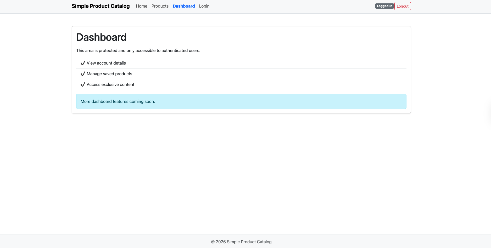

# 🛍️ Product Catalog

A React multi-page application built with React Router v7 that allows users to browse a collection of products and view detailed information for each item.

Users can navigate between pages, explore products in a structured layout, and access dynamic product details using URL parameters.



## 🚀 Features

* Multi-page routing using React Router v7
* Persistent navigation bar with active link styling
* Nested routes with layout structure
* Dynamic product details using URL parameters
* Local product data (no external API required)
* Minimum of 6 products with full details
* “Back to Products” navigation
* Professional 404 Not Found page
* Handles invalid product IDs gracefully


## 🛠️ Technologies Used

* React
* React Router v7

  * `NavLink`
  * `<Outlet />`
  * `useParams()`
  * `useNavigate()`
* JavaScript (ES6+)
* CSS Bootstap
* Vite (development server)


## 🌐 Application Routes

* **Home**
  `/`

* **Products (Layout + List)**
  `/products`

* **Product Details (Dynamic Route)**
  `/products/:id`

* **Home**
  `/login`

* **Home**
  `/dashboard`

* **Not Found (404)**
  `*`

---

## 📦 Installation & Running the App

1. Clone the repository:

   ```bash
   git clone https://github.com/elhamatokhi/Product-Catalog.git
   ```

2. Navigate into the project folder:

   ```bash
   cd product-catalog
   ```

3. Install dependencies:

   ```bash
   npm install
   ```

4. Start the development server:

   ```bash
   npm run dev
   ```

5. Open your browser and visit:

   ```bash
   http://localhost:5173
   ```

---

## 📂 Project Structure

```
src/
 ├── components/
 ├── layouts/
 ├── pages/
 ├── App.jsx
 └── main.jsx
```

---

## 👤 Author

**Elhama Tokhi**

* GitHub: [@elhamatokhi](https://github.com/elhamatokhi)

---

## 📄 License

This project is developed for educational purposes as part of a React Router v7 assignment.
